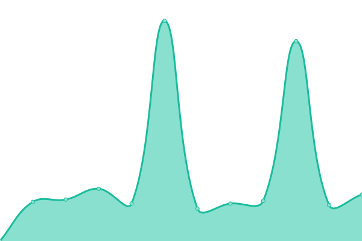

# [📈 Live Status](https://pitchstack-gg.github.io/uptime): <!--live status--> **🟩 All systems operational**

This repository contains the open-source uptime monitor and status page for [pitchstack-gg](https://pitchstack-gg.github.io/uptime), powered by [Upptime](https://github.com/upptime/upptime).

With [Upptime](https://upptime.js.org), you can get your own unlimited and free uptime monitor and status page, powered entirely by a GitHub repository. We use [Issues](https://github.com/pitchstack-gg/uptime/issues) as incident reports, [Actions](https://github.com/pitchstack-gg/uptime/actions) as uptime monitors, and [Pages](https://pitchstack-gg.github.io/uptime) for the status page.

<!--start: status pages-->
<!-- This summary is generated by Upptime (https://github.com/upptime/upptime) -->
<!-- Do not edit this manually, your changes will be overwritten -->
<!-- prettier-ignore -->
| URL | Status | History | Response Time | Uptime |
| --- | ------ | ------- | ------------- | ------ |
|  [Website](https://pitchstack.gg) | 🟩 Up | [website.yml](https://github.com/pitchstack-gg/uptime/commits/HEAD/history/website.yml) | 

 797ms
     
 | 

<a href="https://status.pitchstack.gg/history/website">100.00%</a>
    

|  [Backend API](https://api.pitchstack.gg/healthz) | 🟩 Up | [backend-api.yml](https://github.com/pitchstack-gg/uptime/commits/HEAD/history/backend-api.yml) | 

 801ms
     
 | 

<a href="https://status.pitchstack.gg/history/backend-api">98.99%</a>
    

|  [Auth](https://auth.pitchstack.gg/readyz) | 🟩 Up | [auth.yml](https://github.com/pitchstack-gg/uptime/commits/HEAD/history/auth.yml) | 

 507ms
     
 | 

<a href="https://status.pitchstack.gg/history/auth">100.00%</a>
    

|  [Sync](https://api.pitchstack.gg/powersync/probes/readiness) | 🟩 Up | [sync.yml](https://github.com/pitchstack-gg/uptime/commits/HEAD/history/sync.yml) | 

 438ms
     
 | 

<a href="https://status.pitchstack.gg/history/sync">100.00%</a>
    

<!--end: status pages-->

[**Visit our status website →**](https://pitchstack-gg.github.io/uptime)

## 📄 License

- Powered by: [Upptime](https://github.com/upptime/upptime)
- Code: [MIT](./LICENSE) © [Anand Chowdhary](https://anandchowdhary.com), supported by [Pabio](https://pabio.com)
- Data in the `./history` directory: [Open Database License](https://opendatacommons.org/licenses/odbl/1-0/)
